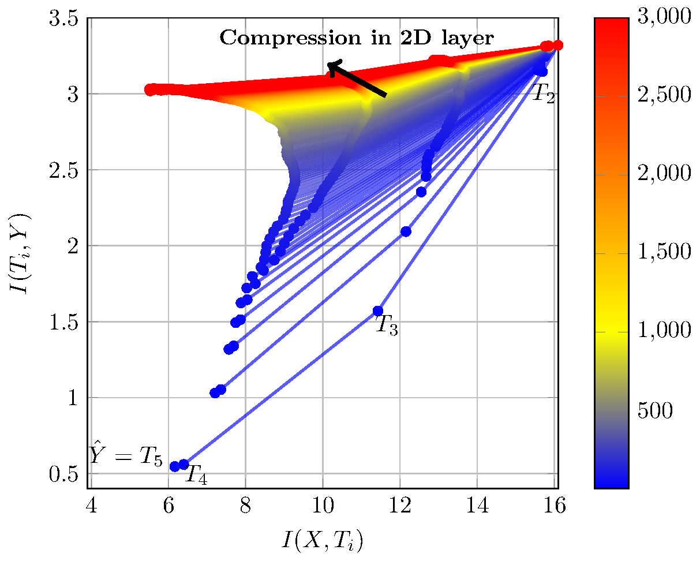

# Information Bottleneck: Exact Analysis of (Quantized) Neural Networks
This repository consists of tools for applying _information bottleneck_ (IB) analysis to neural networks, and specifically for exact IB analysis in quantized neural networks. The repo contains experiments for the ICLR 2022 paper [1]:

> [Stephan Sloth Lorenzen, Christian Igel & Mads Nielsen. _Information Bottleneck: Exact Analysis of (Quantized Neural Networks_.](https://arxiv.org/abs/2106.12912)

The study applies and exact version of the IB analysis for neural networks as investigated and discussed in [2,3].



Information plane for the `Bottleneck-2` network applied to MNIST.

## Requirements
The code has been tested using (Arch) Linux, but runs in Windows with only few modifications.
The following python libraries are required:

* `numpy`
* `pandas`
* `tensorflow`
* `tensorflow_model_optimization`

Furthermore, `lualatex` is required for making the plots. 

## Overview
The important directories and files in the repository are:

* `IB`: Module containing the code for models, training procedure and computation of mutual information (MI).
* `IB/experiment.py`: Code for training procedure.
* `IB/util/estimator.py`: Code for MI estimation/computation.
* `IB/models/models.py`: Networks analysed in the experiments.
* `IB/data`: Contains code for loading MNIST [4] and the synthetic data set of [2].
* `experiment`: Directory with experiments contained in the paper [1].
* `experiment/Makefile`: Linux Makefile for running the experiments and making plots (see below).
* `experiment/helpers/{binning,quantize}.py`: Helper python scripts for running binning and quantization experiments.

## Experiments from [1]
A Makefile is supplied in the `experiment` directory for running the experiments of [1] and creating plots.
Before running any experiments, `cd` to `experiment` and run
```
make link
make data
```
This will link the `IB` module and collect the MNIST data set [4].

### Running experiments
To run the experiments contained in the main body of [1], use:
```
make quantize
```

To run the experiments from the appendix of [1], use:
```
make binning         # Non-quantized/Binning experiments, Appendix A
make bit-width       # 4-/32-bit quantization experiments, Appendix C
make quantize-prefit # Quantization with randomized prefitting, Appendix D
make quantize-archs  # Quantization of different MNIST architectures, Appendix E
``` 
**Please note, that the experiments above may run for a long time and require a significant amount of memory.** Most experiments run for many iterations and computes/estimates MI between large quantities. Time per iteration may be minutes (synthetic data) or more than 12 hours (convolutional MNIST network).

### Plotting results
To create the plots from [1]  (corresponding to the above experiments), use:
```
make plot-quantize   # Main body and Appendix B
make plot-binning    # Appendix A
make plot-bit-width  # Appendix C
make plot-prefit     # Appendix D
make plot-archs      # Appendix E
make plot-accuracy   # Accuracy plots, Appendix F
```
The plots are made using lualatex and will take a few minutes to compile, as many data points are plotted for each information plane.

## Running other experiments
Other experiments can be run using the module directly (note, some options are left out here, use `--help` for the full list):
```
python -m IB experiment [-h] [-n NETWORK] [-af ACT_FUNC] [-lr LR] [-e EPOCHS] [-q]
                              [-b BITS] [-d DATA] [-r REPEATS]

options:
  -n NETWORK     Network to use.
  -af ACT_FUNC   Activation function.
  -lr LR         Learning rate used in training.
  -e EPOCHS      Number of epochs.
  -q             Quantize the model (changes default binning strategy!).
  -b BITS        Number of bits for quantization, if -q set, must be in (4,8).
  -d DATA        Data for experiment
  -r REPEATS     Number of experiment repeats
```

Alternatively, one may use the python helper scripts in `experiment/helpers`:

```
python helpers/binning.py <experiment> [prefit=0] [repeats=50]
python helpers/quantize.py <experiment> <bits> [prefit=0] [repeats=50]
```
where `experiment` is one of `SYN-{Tanh,Relu}` or `MNIST-{4x10,Conv,Bottleneck-2,Bottleneck-4,HourGlass}`, `bits` are the precision of the quantization (4, 8 or 32), and `prefit` is the number of randomized prefitting epochs (0 means no prefitting).

## Acknowledgement
Please cite our paper, if you found the code useful in your work/publication:
```
@inproceedings{
lorenzen2022information,
title={Information Bottleneck: Exact Analysis of (Quantized) Neural Networks}, author={Stephan Sloth Lorenzen and Christian Igel and Mads Nielsen}, booktitle={International Conference on Learning Representations}, year={2022}, url={https://openreview.net/forum?id=kF9DZQQrU0w}
}
```

## References

[1] [Stephan Sloth Lorenzen, Christian Igel, & Mads Nielsen. _Information Bottleneck: Exact Analysis in (Quantized) Neural Networks_. ICLR (2022).](https://arxiv.org/abs/2106.12912)

[2] [Ravid Shwartz-Ziv & Naftali Tishby. _Opening the black box of deep neural networks via information._ arXiv (2017).](https://arxiv.org/abs/1703.00810)

[3] Andrew M. Saxe, Yamini Bansal, Joel Dapello, Madhu Advani, Artemy Kolchinsky, & Brendan D. Tracey. _On the information bottleneck theory of deep learning_. ICLR (2018).

[4] Li Deng. _The MNIST database of handwritten digit images for machine learning research_. IEEE Signal Processing Magazine (2021).
